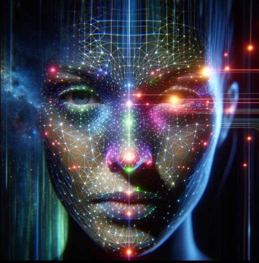

# Facial Keypoint Detection

## Project Overview
This project focuses on defining and training a convolutional neural network (CNN) to perform facial keypoint detection. By using computer vision techniques, it aims to transform images of faces to identify and mark various key facial features. Facial keypoints, also known as facial landmarks, are utilized in a range of applications, including face filters, emotion recognition, and pose recognition. This project is divided into several parts, each encapsulated in Jupyter notebooks and supported by Python.

This project is one of the capstone projects for the [Computer Vision Nanodegree program by Udacity](https://www.udacity.com/course/computer-vision-nanodegree--nd891). The README and the image were initially generated using ChatGPT-4 and were subsequently edited for clarity and context.

  

## Project Structure
- `1. Load and Visualize Data.ipynb`: Introduces the facial keypoints dataset, derived from the YouTube Faces Dataset, and demonstrates how to load and visualize the data.
- `2. Define the Network Architecture.ipynb`: Details the CNN architecture used for facial keypoint detection.
- `3. Facial Keypoint Detection, Complete Pipeline.ipynb`: Combines loading data, model predictions, and visualization of the results in a complete pipeline for detecting facial keypoints.
- `4. Fun with Keypoints.ipynb`: Explores creative applications of facial keypoint detection, such as overlaying sunglasses on faces in images.
- `data_load.py`: Contains code for loading and preprocessing the facial keypoints dataset.
- `models.py`: Defines the CNN architecture used for detecting facial keypoints.

## Getting Started
### Dependencies
To run this project, you will need:
- Python 3.x
- PyTorch
- OpenCV
- Matplotlib
- Numpy
- Pandas

### Installation
* Clone this repository to your local machine.
*  Ensure you have all the required dependencies installed.

## Usage
To replicate the results or experiment with your facial keypoint detection models, follow the notebooks in numerical order. Each notebook is designed to guide you through different stages of the project, from data loading and visualization to defining the network architecture and applying the model to detect facial keypoints in images.

## Contributing
Feel free to fork this repository and submit pull requests to contribute to this project. Whether it's improving the model's accuracy, optimizing the data preprocessing steps, or adding new functionalities, your contributions are welcome.

## License
This project is open-sourced under the MIT license.
